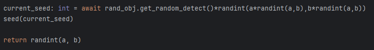

# How it works:

>### We first begin by creating a list of what we'll call "allowed terrain". This list will contain all the pixels that are valid to be sampled. A visualization of the valid sample pixels is provided below:
> 
>### We are only using the center part of the detector as this contains more than enough pixels to sample and I do not want to include circular terrain in the script.

>### After picking a random pixel from the allowed terrain list, we sample it and check if it's 0. If it is, we discard it as the algorithm multiplies the pixel by some other random number to generate the seed, allowing black pixels would make the seed 0.
> 

>### Finally, we pipe the detected pixel into a multiplication by pseudorandom numbers in order to generate a random seed, which we then pass to random's seed(), after this, you receive a genuinely random number between the specified range.
> 

---

# How do you use it?

### Simply download the .py files from the repo and store them wherever is convenient. Then import ==random_int()== from *kmkrandom*.

## Important: random_int() is an asynchronous function as it needs to fetch from a URL, remember to use ==await== on it.
